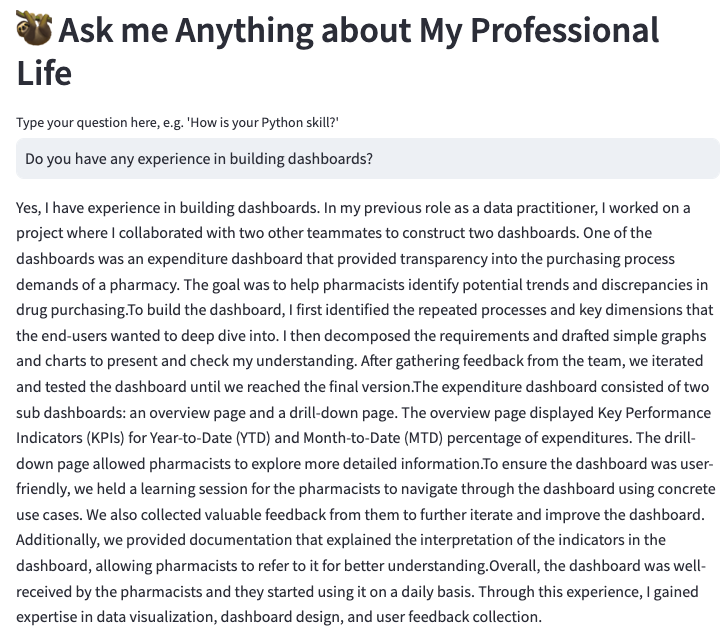
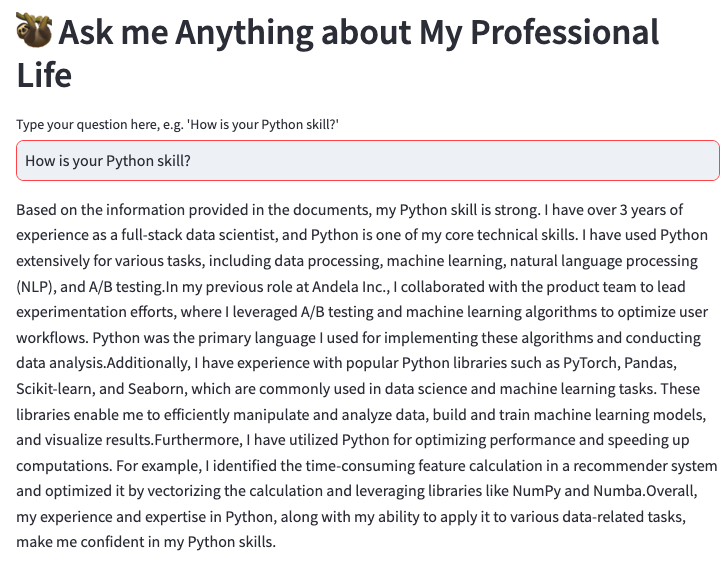
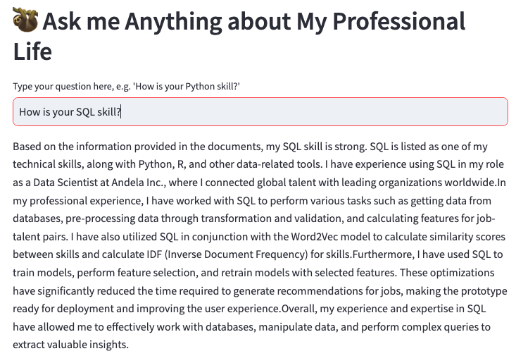

# Ask Weishan Anything (about her professional life)

In this project, I applied LangChain to leverage the power of GPT3.5 to build a chatbot which can answer questions about my profesional life. The front-end interface is powered by Streamlit. You can ask questions like "How is your Python skill?", "Tell me about a time when you use data to generate meaningful insights", etc. The bot will answer your questions based on the materials that I prepared, including resume, project stories, etc.

## Sample App

## Model Building
LangChain is a powerful framework that enables us to develop our LLM-based applications in simple Python code. The whole development process for my chatbot involves the following steps:
1. Build Vectorstore - ingest.py
I first read the files that I want to use to build the database. Then I used LangChain's `RecursiveCharacterTextSplitter`
function to divide the raw text into chuncks. Following, I applied the `FAISS` library to convert the chunks into vectors and store them in a vectorstore. The vectorstore aka database is exported as a pickle file. I employed `OpenAIEmbeddings()` in this project but you can also take advantage of other embedding models available at HuggingFace. 

2. Build the chatbot - chatbot.py
In order to enable the chatbot to answer questions based on my past experience, I applied `similarity_search` between the database and the user input. The `similarity_search` function returns the top 8 most similar chunks. Then I used `GPT3.5` to generate the answer based on the top 8 chunks.

3. Build the app - app.py
I used Streamlit to build the front-end interface.

## Performance
The chatbot is able to answer questions based on my data. However, sometimes it may match the tasks that I did in comapy A to the questions about company B. 

## Next Steps
1. Deploy the model to Streamlit Community Cloud
I tried to deploy the model to Streamlit Community Cloud but encounter some hurdles. Specifically, when generating the answer, there is a `TypeError: search() missing 3 required positional arguments: 'k', 'distances', and 'labels'`. It seems that it is a common problem encountered by many people. In the ingest.py, I generated a FAISS vectorstore and then pikle the result for later use. That means that I generated the pickle file on the ARM64 architecture and errors happen wehn I try to use the same file on other architectures. I haven't found a solution to this problem yet. I will keep working on it and update the project once I figure it out.

2. Improve the performance
As mentioned before, the chatbot mixed my experience across different companies. I will try to improve the performance by modifying the data, using other Chains such as `ConversationalRetrievalChain` instead of LLMChain in Langchain, or fine tune soem hyperparameters, etc.

3. Replace OpenAI model with other Open Source models
I used models from OpenAI in this project. However, OpenAI is not open source and therefore will trigger some costs. I will try to replace the OpenAI model with other open source models such as Llama 2, etc.

